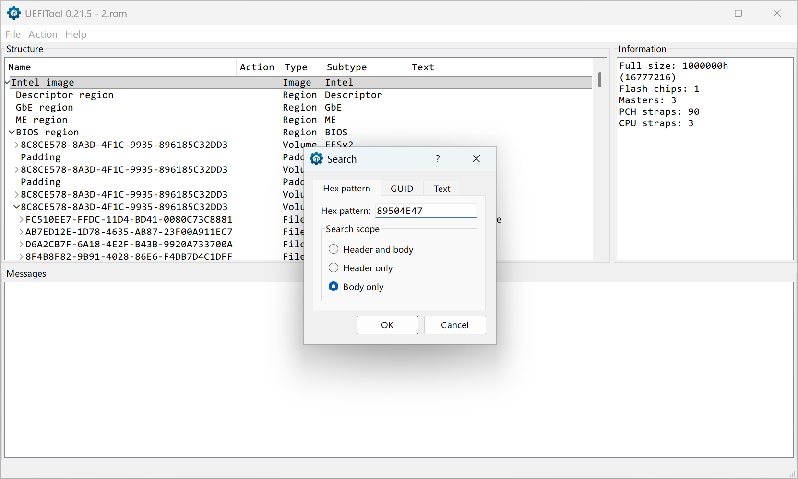
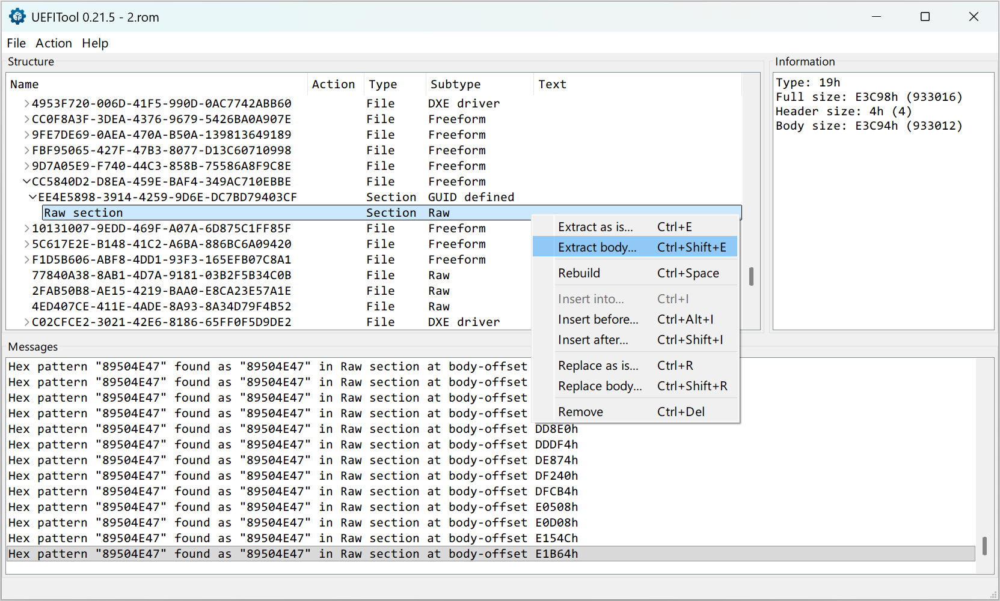
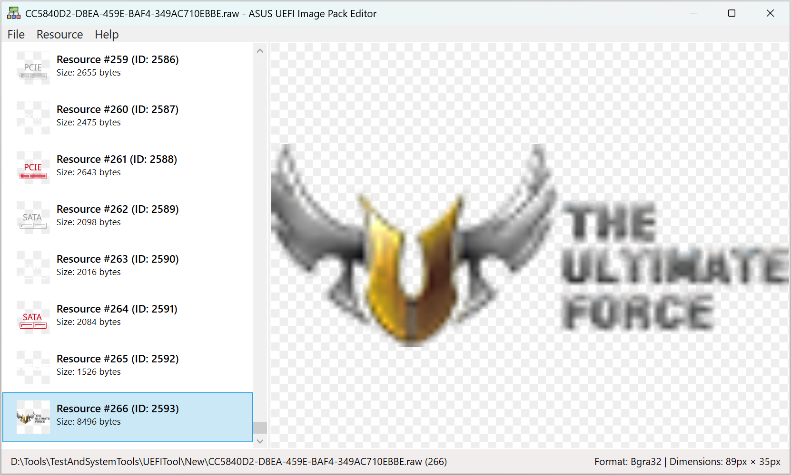

# ASUS UEFI Image Pack Editor

A lightweight utility for extracting and modifying images within ASUS UEFI firmware.

一款轻量级工具，用于提取并修改华硕 UEFI 固件中的图像资源。

## Usage Examples / 使用示例

### Export / 导出

### Edit / 编辑

## License / 开源许可

This project is licensed under the MIT License — see the [LICENSE](LICENSE.md) file for details.

此项目根据 MIT 许可证授权，详见 [LICENSE](LICENSE.md) 文件。
